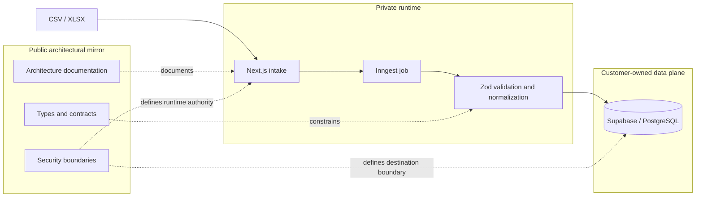

# ImportFlow

ImportFlow defines a narrow, fail-closed contract for moving CSV or XLSX data into one Supabase-hosted PostgreSQL table.

## Status

ImportFlow is not currently an end-to-end importer. This public mirror documents the security boundary, contract model, refusal behavior, and target architecture. Current executable evidence stops at schema observation, schema fingerprinting, and a compiler that returns either an inert non-executable plan or a refusal. It does not emit or execute SQL.

There is no public importer UI, hosted service, customer gateway, automated production write path, or completed customer deployment. Private and planned components described here are architecture boundaries, not availability claims.

| State                                          | Evidence                                                                                                                                                                                                                                  |
| ---------------------------------------------- | ----------------------------------------------------------------------------------------------------------------------------------------------------------------------------------------------------------------------------------------- |
| Public and available now                       | The architecture decision, contract model, security boundary, supported envelope, refusal rules, and explicitly labeled synthetic evidence.                                                                                               |
| Verified locally or through synthetic evidence | Read-only schema observation against local synthetic PostgreSQL, deterministic fingerprinting and refusal behavior, and a separate one-table CSV rehearsal with reconciled synthetic counts. This is not customer or production evidence. |
| Private implementation                         | File intake, mapping, validation, authentication, orchestration, retry handling, and destination-write internals are outside the public surface. Their privacy does not establish that they are complete.                                 |
| Planned or gated                               | The private runtime, executable destination artifacts, customer-hosted gateway, automated writes, importer UI, self-serve onboarding, and hosted operation.                                                                               |
| Explicitly unsupported                         | Arbitrary databases or tables, multiple destination tables, updates or upserts, JSON/JSONB and arrays, generic destination reads, automatic schema repair, and universal rollback.                                                        |

## Problem boundary

CSV parsing determines rows and cells. It does not determine what those values are authorized to control.

An import contract must resolve several independent questions before a destination write can be considered:

- Field provenance: a file-supplied value is not interchangeable with a tenant identifier, server-created identity, reviewed constant, or database default.
- Tenant binding: ownership values must come from authenticated and authorized context. A browser or spreadsheet must not select them.
- Database-generated values: identity, default, and generated columns must be omitted or handled under an explicit identity rule.
- Schema drift: types, constraints, grants, row-level security, indexes, and triggers may change after review.
- Constraint behavior: accepted rows remain subject to destination types, checks, uniqueness, foreign keys, policies, and declared side effects.
- Retry semantics: a missing response does not establish whether a write committed. A retry must preserve the same identity and payload.
- Reconciliation: submitted, excluded, inserted, failed, and unresolved rows are different outcomes. A partial or unknown result must not be reported as success or as a proven zero-write failure.

The contract is closed. Unknown fields, authority, destination shapes, and write modes are refused rather than inferred.

## Current scope

Current evidence covers two separate layers.

The compiler accepts a contract for Supabase PostgreSQL 17, exactly one writable base table in the `public` schema, and insert-only behavior. It can describe either a database-generated identity without returning destination identifiers or a trusted server-supplied UUID when the destination accepts and preserves it. Its output is an inert plan or a refusal. It does not parse a file, connect to a customer database, or execute a write.

The current founder-assisted workflow accepts CSV or XLSX for one table and insert-only preparation. Validation uses sanitized or synthetic data in disposable local staging. The buyer's engineer reviews and executes the final production `COPY` inside the buyer's environment. This is a manual service boundary, not an automated product claim.

Mappings are closed. A source header may map only to a destination column explicitly approved as file-supplied. The current compiler consumes an already classified contract; interactive mapping remains planned.

## Public and private boundaries

| Public                                                                     | Private                                                                                                           | Planned/Gated                                                                     |
| -------------------------------------------------------------------------- | ----------------------------------------------------------------------------------------------------------------- | --------------------------------------------------------------------------------- |
| Architecture, contract definitions, security boundaries, scope, and status | File intake, authentication adapters, mapping and validation logic, and runtime composition                       | CSV/XLSX intake and review workflow backed by the private runtime                 |
| Exported types and contract definitions approved for publication           | Job orchestration, queues, retries, reconciliation internals, and observability                                   | Executable contract compilation and reviewed destination artifacts                |
| Non-executable examples and explicitly labeled synthetic evidence          | Database definitions, migrations, row-level security policies, internal functions, and destination-write code     | Customer-hosted gateway installation and destination writes                       |
| Protocol and data-handling boundaries                                      | Secrets, credentials, signing material, deployment configuration, customer data, and internal operational records | Self-serve importer, hosted operation, public onboarding, and customer deployment |

Material visible during development is not automatically part of the public contract. The public boundary is limited to the architecture, published contracts, and explicitly labeled synthetic evidence.

## Architecture

Target private runtime architecture:

This is target architecture, not a current deployment diagram. The Next.js, Inngest, and Zod runtime is private, and this public mirror does not establish that the complete runtime exists. The destination write path remains gated and planned. Current code generates no SQL, and the current founder-assisted workflow leaves the final production `COPY` to the buyer's engineer.

## Contract model

Every destination column has one value-provenance class. Classification determines who may supply the value; it is not display metadata.

| Provenance                  | Authority                                                                                                                     | Status                                                                                    |
| --------------------------- | ----------------------------------------------------------------------------------------------------------------------------- | ----------------------------------------------------------------------------------------- |
| File-supplied               | May come from a closed, approved source mapping and must pass contract validation. Unknown or extra columns are not admitted. | Defined in the current contract model. File parsing and interactive mapping are planned.  |
| Authenticated/session-bound | Tenant and other session values must come from independently authorized server context, never from a file or browser field.   | Defined structurally. Runtime authorization and destination enforcement are gated.        |
| Trusted server-generated    | A stable server-created UUID is permitted only for the accepted UUID identity shape and must remain unchanged across retries. | The compiler can describe the compatible shape. Identifier creation and writes are gated. |
| Developer constant          | A reviewed literal is fixed by the contract and is never file-controlled.                                                     | Defined by the contract model. Executable compiler support remains deferred.              |
| Database-generated          | The input omits the column so an accepted destination default, identity, or generated behavior supplies it.                   | Represented in the inert plan. No database execution exists.                              |
| Unsupported                 | The required column or behavior cannot be represented inside the closed contract.                                             | Refused. It is not approximated or silently repaired.                                     |

A schema fingerprint binds the structural facts that affect interpretation and write authority. It identifies one canonical schema description. It does not prove that a live database is current, that a caller is authentic, or that a contract is active.

## Failure model

Current executable code fails closed. Compilation either produces a complete inert result or a refusal with no partial plan, fallback SQL, or automatic repair. Invalid schema descriptions, fingerprint disagreement, unsupported destination shapes, unsupported write modes, and missing authority all block progress.

The target runtime applies the same rule before destination mutation. Batches are intended to be atomic. An identical retry must preserve the same job, sequence, payload hash, contract identity, and any server-generated identity. A conflicting retry must be rejected. If durable evidence cannot determine whether a represented write committed, the result remains `outcome_unknown`. Success and retry-all are prohibited until reconciliation establishes the outcome.

These destination rules are gated architecture, not evidence of a deployed job system.

## Security boundary

ImportFlow does not take custody of customer production credentials in the current founder-assisted workflow. It never asks for or receives a Supabase `service_role` key, database password, connection string, session token, or equivalent production secret. Validation uses sanitized or synthetic material in disposable local staging. The customer's engineer executes the production `COPY` inside the customer-owned environment.

The target architecture preserves that custody rule. ImportFlow's control plane must not store a customer database credential or customer assertion private key. Any project-local privileged credential required by a future customer-hosted gateway remains inside the customer's Supabase environment.

A `service_role` credential bypasses row-level security. The planned gateway therefore cannot rely on that credential being narrow. Its fixed operation set, contract-specific write authority, customer-controlled publication, and independently authorized tenant context are load-bearing requirements. This is design intent and a release gate, not evidence of implemented enforcement.

Production credentials, signing material, customer data, and private deployment configuration are outside the public boundary and must never be committed to it.

Detailed decision: [Why I won't hold your `service_role` key](docs/adr-001-service-role-custody.md).

## Non-goals

The current scope does not include:

- arbitrary CSV-to-database import or arbitrary PostgreSQL support;
- more than one destination table or a destination outside the accepted Supabase PostgreSQL 17 envelope;
- updates, upserts, merges, overwrites, deletes, or row-tolerant conflict skipping;
- JSON/JSONB, arrays, composites, domains, range types, required file-mapped foreign keys, views, or partitioned targets;
- custom destination schemas, generic SQL, generic remote procedure calls, or a `service_role` proxy;
- automatic schema repair, trigger rewriting, side-effect inference, or silent acceptance of drift;
- automatic production writes, production undo, or a universal rollback claim;
- a hosted importer, self-serve UI, or completed customer deployment;
- performance, reliability, uptime, compliance, or enterprise-readiness claims.

## Project status

ImportFlow is pre-Public-MVP. Current evidence establishes a narrow contract model, deterministic schema fingerprints, explicit refusal behavior, and synthetic one-table workflow evidence. It does not establish an end-to-end private runtime, executable destination artifacts, automated writes, customer deployment, or production reliability.
