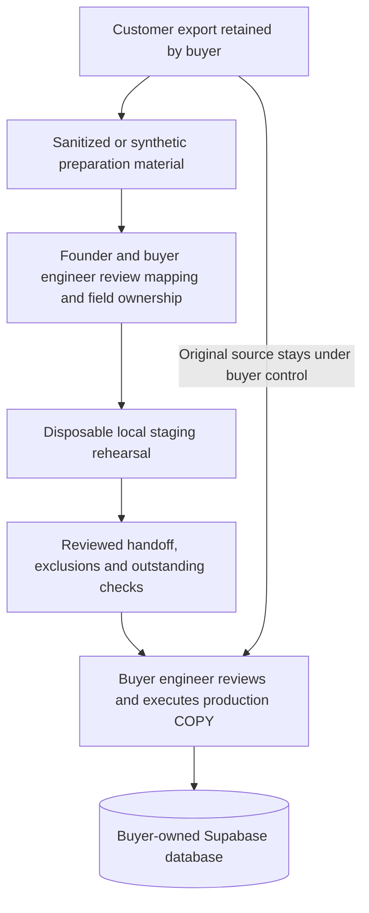

# Data and authority flow

## Current: founder-assisted preparation

The current engagement prepares one supported Supabase PostgreSQL 17 table for insert-only import. Preparation uses sanitized or synthetic material in disposable local staging. The buyer controls production execution.

The handoff does not grant ImportFlow destination authority. Production passwords, connection strings, service-role keys and session credentials stay with the buyer. Local rehearsal establishes only the tested conditions; live permissions, data, side effects and final results still need customer-side review.

## Current: separate static checker

[PG Import Check](https://check.importflow.dev) executes no SQL and makes no database connection. Its report describes supplied declarations, not live schema state or source-row validity. Using it does not initiate a commercial engagement or send a report to ImportFlow. Its [public source and architecture](https://github.com/iammohamedatef/pg-import-check) document that boundary.

## Built foundations and planned execution

Current private foundations include schema observation, deterministic schema fingerprints and a compiler that produces an inert plan or refusal. They do not produce executable SQL or constitute an end-to-end importer.

[ADR-001](adr-001-service-role-custody.md) selects a future customer-hosted gateway with reviewed contract-specific database authority. Gateway installation, dual authorization, durable batch receipts and automated writes are planned/gated. The diagrams above deliberately show current workflows only.

The [importer architecture guide](https://importflow.dev/guides/how-to-build-a-csv-importer) teaches a broader implementation checklist; it is not a list of available ImportFlow features.
